# 一. 计算机系统概述（硬件+软件） <!-- omit from toc -->

- [1. 计算机发展历史](#1-计算机发展历史)
- [2. 计算机硬件的基本构成](#2-计算机硬件的基本构成)
  - [2.1. 冯诺依曼机 — 运算器为中心](#21-冯诺依曼机--运算器为中心)
  - [2.2. 现代计算器结构 - 存储器为核心](#22-现代计算器结构---存储器为核心)
  - [2.3. 小结](#23-小结)
- [3. 各个硬件的工作原理](#3-各个硬件的工作原理)
  - [3.1. 主存储器](#31-主存储器)
  - [3.2. 运算器](#32-运算器)
  - [3.3. 控制器](#33-控制器)
  - [3.4. \*\*\*指令执行过程模拟](#34-指令执行过程模拟)
  - [3.5. 小结](#35-小结)
- [4. 计算机系统的层次结构](#4-计算机系统的层次结构)
  - [4.1. 机器语言层级](#41-机器语言层级)
  - [4.2. 三个级别的语言](#42-三个级别的语言)
  - [4.3. 小结](#43-小结)
- [5. 计算机的性能指标](#5-计算机的性能指标)
  - [5.1. 存储空间](#51-存储空间)
  - [5.2. CPU的性能指标](#52-cpu的性能指标)
  - [5.3. 系统整体性能指标](#53-系统整体性能指标)
  - [5.4. 小结](#54-小结)

# 1. 计算机发展历史

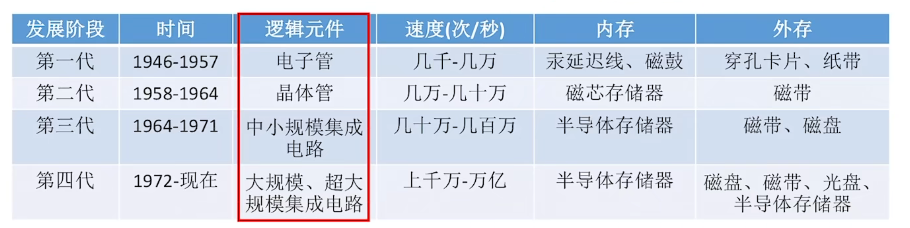

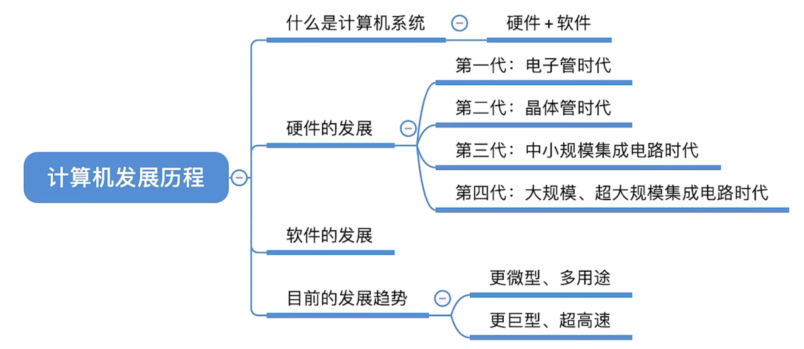

# 2. 计算机硬件的基本构成

## 2.1. 冯诺依曼机 — 运算器为中心

冯·诺依曼提出了“存储程序”的概念，指将指令以代码的形式事先输入到计算机主存储器中，按照该程序的规定顺序执行其他指令，直至结束。

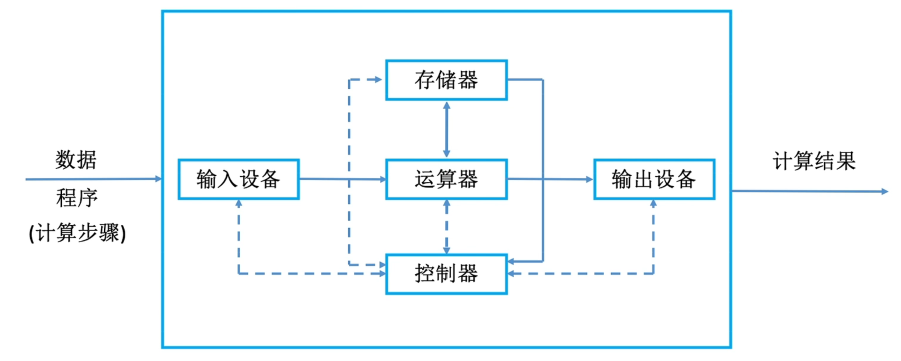

> 实现：数据线  
> 虚线：控制线和反馈线

- 输入设备：将信息转换成机器能识别的形式
- 运算器：算术运算 & 逻辑运算
- 存储器：存放数据和程序
- 控制器：指挥程序运行
- 输出设备：将结果转换成人们熟悉的形式

**特点：**
1. 5大部件组成
2. 指令和数据以同等地位存于存储器内，并可按地址寻访
3. 指令和数据均用二进制代码表示
4. 指令由操作码（操作的性质）和地址码（存储器中的位置）组成
5. 指令在存储器内按顺序存放
6. 以运算器为中心

## 2.2. 现代计算器结构 - 存储器为核心

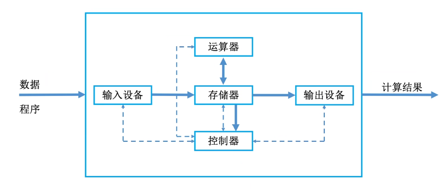

> CPU = 运算器 + 控制器

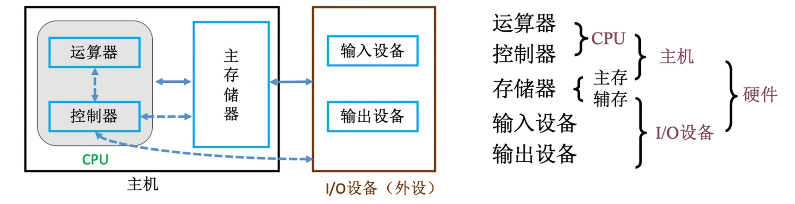

输出的数据——直接从存储器中取走即可，不需要再经过运算器 -> 效率高。

> 主存：相当于运行内存  
> 辅存：相当于硬盘

## 2.3. 小结

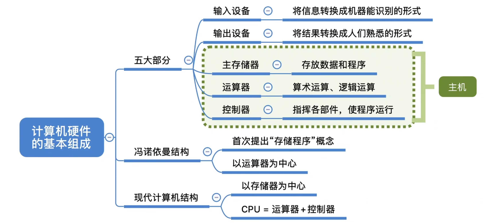

# 3. 各个硬件的工作原理

## 3.1. 主存储器

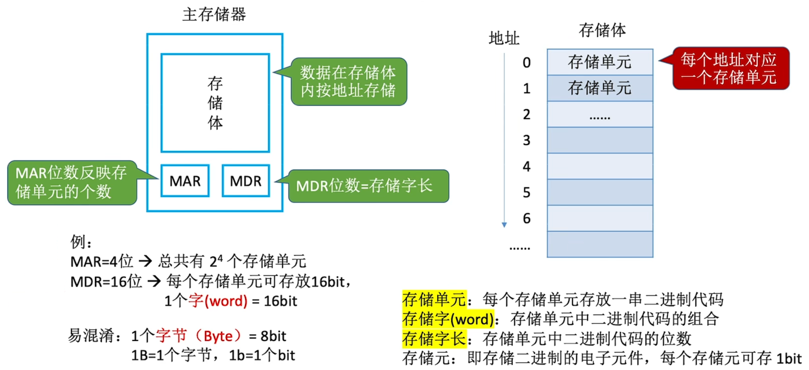

> MAR：Memory Address Register（存储地址寄存器）  
> MDR：Memory Data Register（存储数据寄存器）

> 一个字节（Byte）被定义为8bit  
> 一个字（word）有几个bit取决于计算机

## 3.2. 运算器

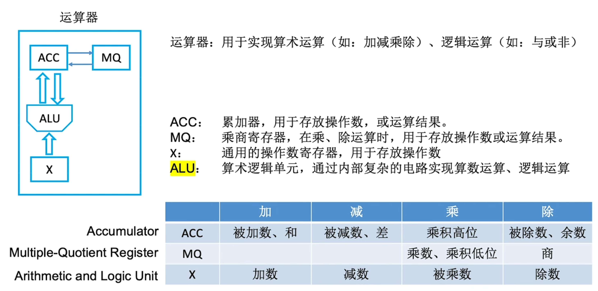

## 3.3. 控制器

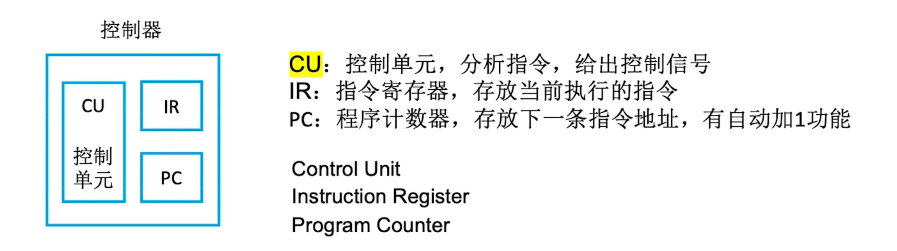

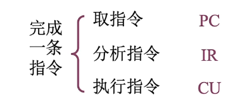

## 3.4. \*\*\*指令执行过程模拟

**举例：**

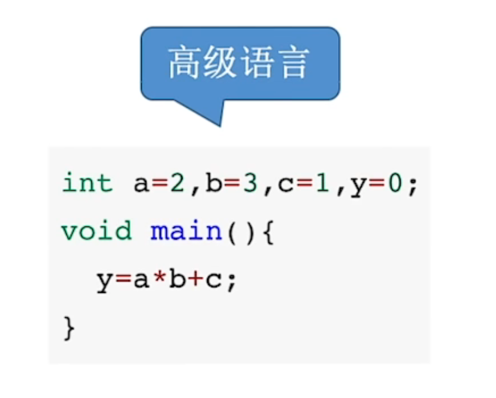

**编译并装入内存后：**

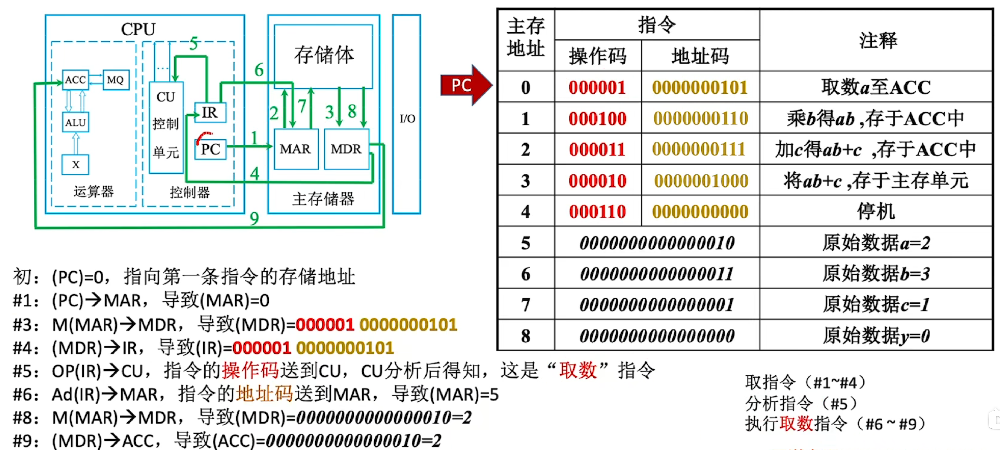

**-> PC初始为0，开始执行第一条主存地址中的指令**：

- Step 1：控制器（PC）向主存的 MAR 指明了接下来要访问0号地址，并告知将进行“读操作”；
- Step 2：MAR 去找出存储体中0号地址的操作码和地址吗；
- Step 3：存放至，此时 MDR 包括操作指令及地址；
- Step 4：放置指令寄存器（IR）；
- Step 5：操作码送到控制单元（CP），分析指令类型；
- Step 6：将地址码送到 MAR，导致 MAR 的值为5；
- Step 7：主存储体找出5号单元的数据；
- Step 8：数据（a的值）放到 MDR；
- Step 9：给到累加寄存器（ACC）。

**-> PC自动加1，开始执行下一条主存地址中的指令，乘法**：

- 前8步相同，直至把 b 的值放入 MDR；
- Step 9：将 b 的值从 MDR 放入乘商寄存器（MQ）中；
- Step 10：将 a 的值从 ACC 放入操作器寄存器（x）中；
- Step 11：CU 告知算术逻辑单元（ALU），将 MQ 和 x 中的值相乘，结果放回 ACC；
- ALU实现运算，如果乘机太大，则需要 MQ 辅助存储。

**-> PC自动加1，开始执行下一条主存地址中的指令，加法**：

- 前8步相同，直至把 c 的值放入 MDR；
- 加法不需要 MQ，a*b 的值一直在 ACC；
- Step 9：将 c 的值从 MDR 放入操作器寄存器（x）中；
- Step 10：CU 告知算术逻辑单元（ALU），将 x 中的值加入到 ACC 中，实现相加。

**-> PC自动加1，开始执行下一条主存地址中的指令，存数**：

- 前6步相同，将指令的地址码存放至 MAR，导致 MAR 的值为8；
- Step 7：将 ACC 的数值放回到 MDR；
- Step 8：MAR 将地址告知存储体；
- Step 9：存储器将 MDR 中数据放到对应地址，给出最终结果。

**-> PC自动加1，开始执行下一条主存地址中的指令，停机**：

- 第五步分析到停机指令，停止。

> 前五步为必经步骤，之后具体指令不同步骤不同。

## 3.5. 小结

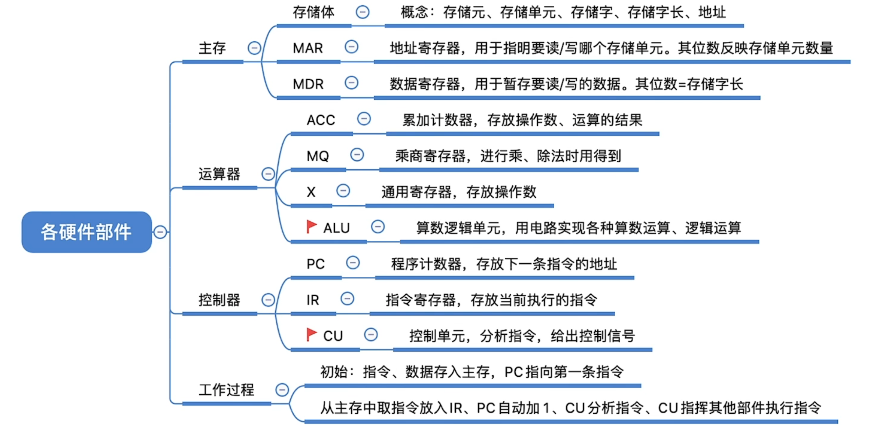

> MAR 和 MDR 有时会放到 CPU 中。

# 4. 计算机系统的层次结构

## 4.1. 机器语言层级

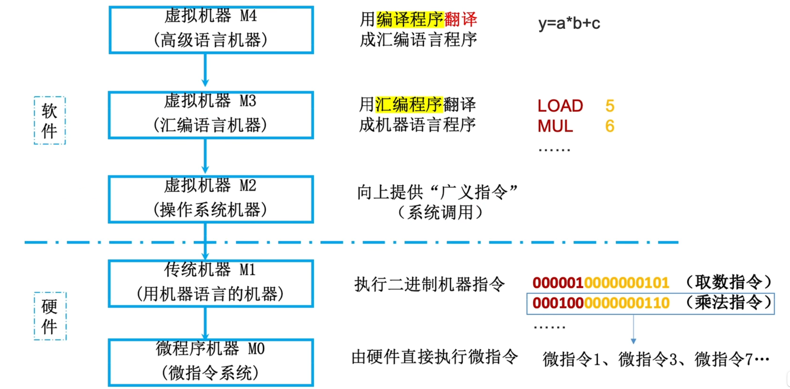

-- 高级语言 --[编译程序]-->   
-> 汇编语言 --[汇编程序]-->   
-> 机器语言（对应上一章的操作码）--[硬件执行]-->   
-> 微指令（对应上一章各个step）  

> 汇编语言和机器语言本质等价，只是方便识别，e.g., LOAD 对应 5

## 4.2. 三个级别的语言

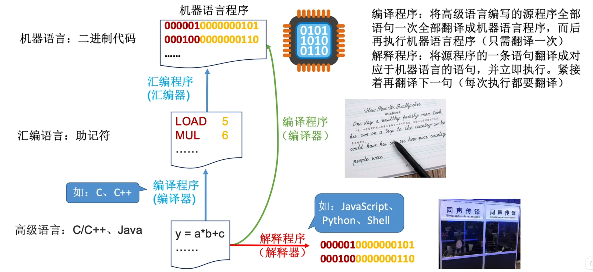

> 编译性语言只用编译一次，比如C生成的.exe  

## 4.3. 小结

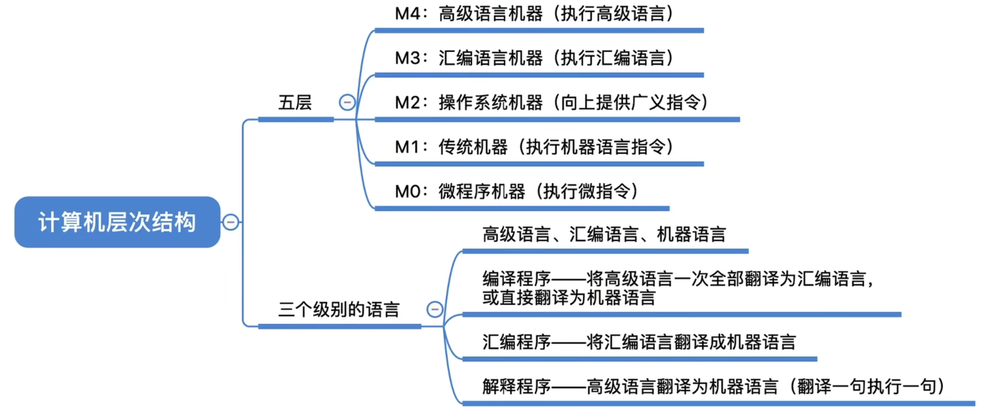

# 5. 计算机的性能指标

## 5.1. 存储空间

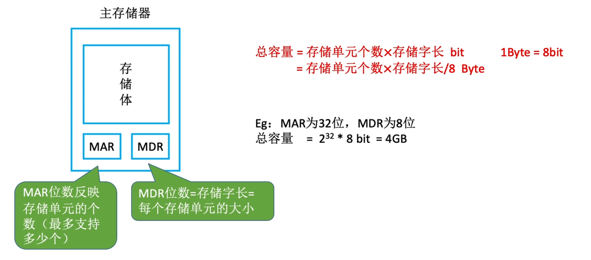

> e.g., 一共可以存$2^{32}$个地址，每个地址8位。
## 5.2. CPU的性能指标

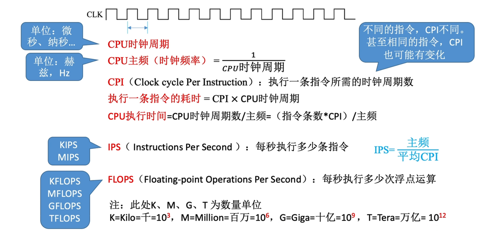

- 主频：CPU 内数字脉冲信号震荡的频率
- CPI：平均一条指令会信号震荡的次数
- 3 TFLOPS 代表每秒可以进行3万亿次浮点数运算

## 5.3. 系统整体性能指标

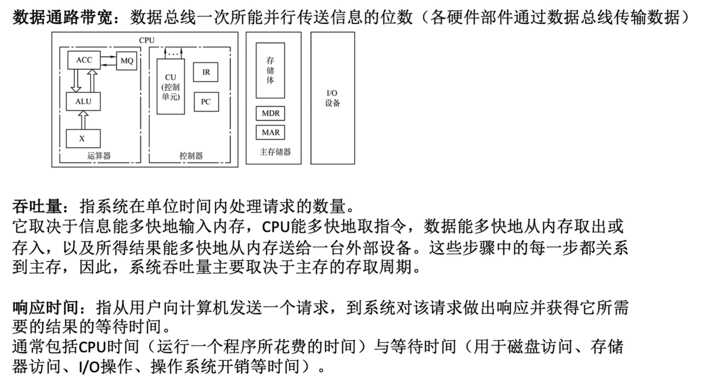

> 以上为静态指标，还有更为直观的动态指标，比如鲁大师的跑分软件。。。

## 5.4. 小结

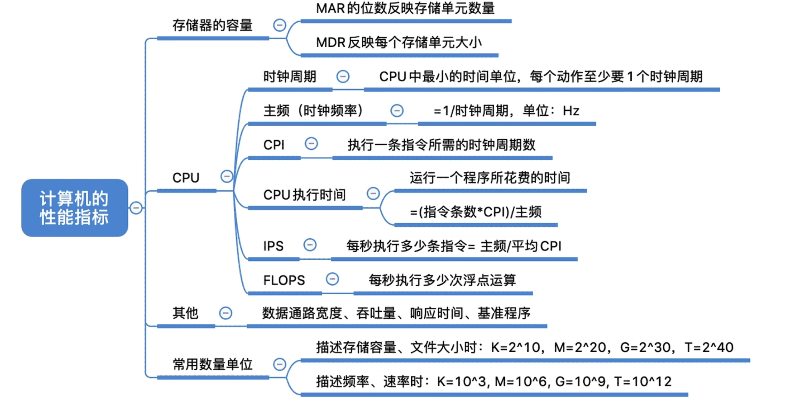
