# 绪论

# 1 基本概念和术语

## 1.1 数据概念

### 1.1.1 基本数据概念

- **数据（Data）**：能输入计算机并能被计算机处理的各种符号的集合。
- **数据元素（Data Element）**：数据的基本单位，一个整体，比如一张表中的一行。
- **数据项（Data Item）**：不可分割的最小单位，比如一行中的一个值。
  - 数据 > 数据结构 > 数据项
- **数据对象（Data Object）**：性质相同的数据元素的集合，是数据的一个子集。

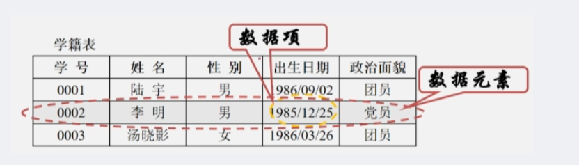

### 1.1.2 数据结构

分为三个方面：逻辑结构、物理结构（或存储结构）以及运算和实现。

#### 逻辑结构：
- 划分方法一：
  1. **线性结构**：只有一个开始和终端节点，并所有节点都最多只有一个前继和一个后继（一对一），例如：线性表、栈、队列、串
  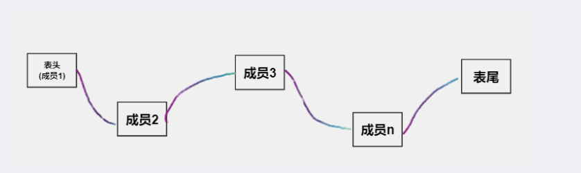
  2. **非线性结构**：一个结点可能有多个直接前趋和直接后继（一对多或多对多），例如：数、图。
  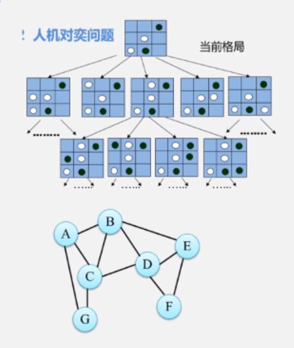
- 划分方法二：
  1. **集合结构**：结构中的数据元素之间除了同属于一个集合的关系之外，没有其他任何的关系。
  2. **线性结构**：结构中的数据元素之间存在着一对一的线性关系。
  3. **树形结构**：结构中的数据元素之前存在着一对多的层次关系。
  4. **图状结构或网状结构**：结构中的数据元素之间存在着多对多的任意关系。


#### 存储结构
1. **顺序存储结构**
  - 用一组连续的存储单元依次存储数据元素，数据元素之间的逻辑关系由元素的存储位置来表示 -> **数组**。
   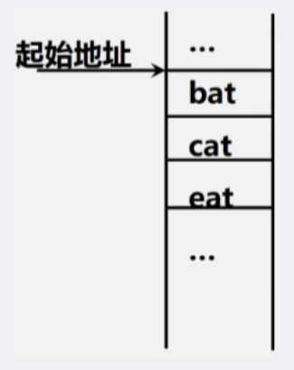
2. **链式存储结构**
  - 用一组任意的存储单元存储数据元素，数据元素之间的逻辑关系用指针来表示 -> **指针**。
  - 存储着每个元素本身的同时，还存储着下一个元素的地址。
  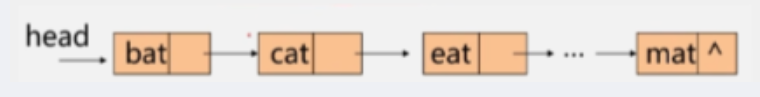
3. **索引存储结构**
  - 在存储结点信息的同时，还建立附加的索引表。
  - 索引表中的每一项称为一个索引项 (index)，一般形式是：（关键字，地址）。
  - 若每个结点在索引表中都有一个索引项，则该索引表称之为**稠密索引**（Dense Index）。
  - 若一组结点在索引表中只对应一个索引项，则该索引表称之为**稀疏索引**（Sparse Index）。


#### 散列存储
- 根据结点的关键字直接计算出该结点的存储地址。
 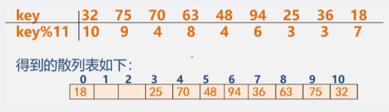


 
### 1.1.3 数据类型和抽象数据类型

#### 数据类型（Data Type）

- int、char、float、double、数组、结构体、共用体、枚举。。。
- 作用：
  - 约束变量或常量的取值范围。
  - 约束变量或常量的操作
- 定义：数据类型是一组性质相同的值的集合以及定义于这个值集合上的一组操作的总称。
  - 数据类型 = 值的集合 + 值集合上的一组操作。

#### 抽象数据类型（Abstract Data Type）

- 整型、实型、字符型等，可以进一步利用这些类型构造出线性表、栈、队列、树、图等复杂的抽象数据类型。
- 定义：一个数学模型以及定义在此数学模型上的一组操作。

##### 抽象数据类型的形式定义：
- 抽象数据类型可用（D，S，P）三元组表示。
  - D 是**数据对象**；
  - S 是 D 上的关系集，即**数据关系**；
  - P 是对 D 上的**基本操作**集。
- 定义格式：
  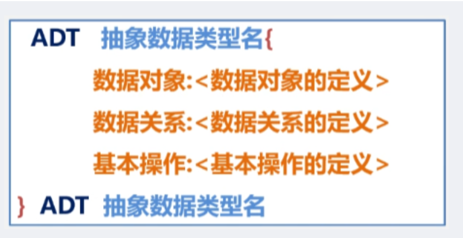

- 其中：数据对象、数据关系的定义用伪代码描述。
- 基本操作的定义格式为：
   - 基本操作名（参数表）；
   - 初始条件：<初始条件描述>；
   - 操作结果：<操作结果描述>。
  
基本操作定义格式说明

- 参数表：
   - 赋值参数：只为操作提供输入值。
   - 引用参数：以 & 打头，除了可提供输入值以外，还将返回操作结果。
- 初始条件：
   - 描述操作执行之前数据结构和参数应满足的条件；
   - 若不满足，则失败；若为空，则省略。
- 操作结果：
   - 数据结构的变化状况和应该返回的结果。

举例：
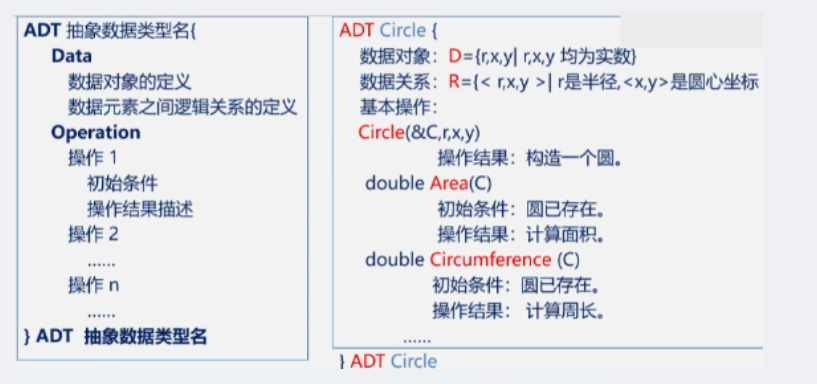

-> 返回C，即计算出的圆。

``` C
#include <stdio.h>
#include <math.h>
void Circle(int* C,int r,int x,int y)//数据对象
{
        C[0]= r;
        C[1]= x;
        C[2]= y;
}
double Area(int* C)
{
        return 3.14 * pow(C[0],2);
}
double Circumference(int* C)
{
        return 2 * 3.14 * C[0];
}
int main()
{
        int C[3]= {0},r,x,y;
        int i;
        printf("请输圆的半径及xy的坐标");
        scanf ("%d %d %d",&r,&x,&y);

        Circle(C,r,x,y);
        printf("圆的面积是：%lf\n",Area(C));
        printf("圆的周长是：%lf\n",Circumference(C));
        return 0;
}
```

### 1.1.4 概念小结

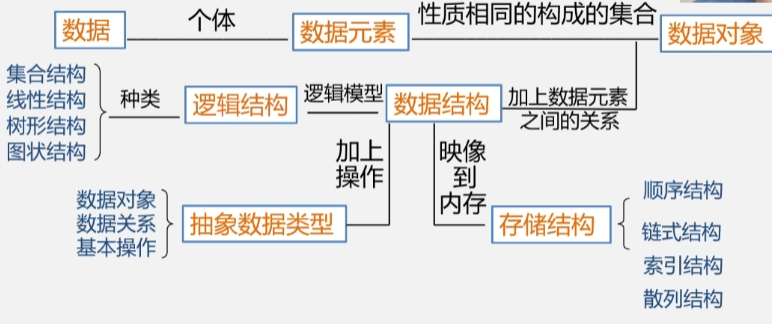

## 1.2 算法和算法分析

### 1.2.1 算法的特性

**一个算法必须具备一下五个重要特性：**

- 有穷性：必须总是在执行有穷步之后结束。
- 确定性：在任何条件下，只有唯一的一条执行路径，即对于相同的输入只能得到相同的输出。
- 可行性：可执行的，算法描述的操作可以通过已经实现的基本操作执行有限次来实现。
- 输入：可以没有输入。
- 输出：必须要有输出。

### 1.2.2 算法设计的要求

- 正确性：算法满足问题的要求，能正确解决问题。
- 可读性：易于理解。
- 健壮性：
  - 非法输入时，恰当的做出反应或进行相应处理，而不产生莫名其妙的输出。
  - 处理出错的方法，不应该是中断程序，而应该是返回一个表示错误或错误性质的值。
- 高效性：花费尽量少的时间和尽量低的空间.

### 1.2.3 时间复杂度

- 算法运行时间 = ∑ 每条语句的执行次数 x 该语句执行一次所需要的时间。
- 其中，每条语句的执行次数称为语句频度。
- 后者是由机器本身软硬件环境决定的，与算法无关。
- 通过前者定义时间复杂度，即频度之和。

**举例：两个 n x n 矩阵相乘的算法可描述为**

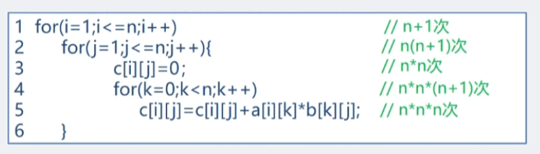

- 注意：for 循环需要进行n+1次判断，for循环内的部分即进行n次运算。
- 把算法耗费的时间定义为该算法中每条语句的频度之和，则上述算法的时间消耗为 $T(n)$ 为：$T(n) = 2n3 + 3n2 + 2n + 1$

**算法时间复杂度的渐进表示法**

- 便于比较不同算法的时间效率，我们仅比较它们的数量级（抓次方最大的）。
- 若有某个辅助函数 $f(n)$，使得当 $n$ **趋近于无穷大时**，$T(n) / f(n)$ 的极限值为不等于零的常数时，记作$ T(n) = O(f(n))$。
- 即$O(f(n))$ 为算法的渐进时间复杂度（O是数量级的符号），简称**时间复杂度**。
- 上述例子时间复杂度为：$T(n) = O(n^3)$。
- 简单方法：循环体中，嵌套层次最深的，往往就是执行次数最多的语句。

**举例：**
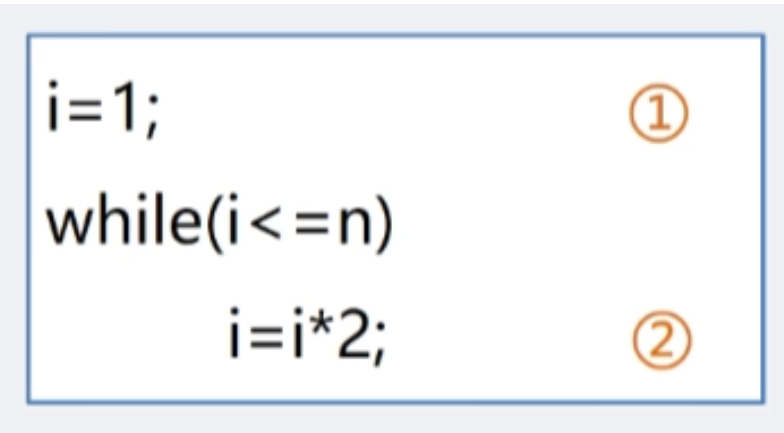

- 假设语句执行次数为 x 次，由循环条件 i <= n可知，2x <= n，所以 $x <= log₂n$
- 时间复杂度 $T(n) = O(log₂n)$。

**考虑算法的时间复杂度时还应考虑**

有的情况下，算法时间复杂度还随问题的输入数据集不同而不同。比如从数组中查找某个数，可能一开始就找到，也可能最后才找到。

- 最坏时间复杂度
- 平均时间复杂度
- 最好时间复杂度

-> 一般总是在考虑最坏情况下的时间复杂度，以保证算法的运行时间不会比它更长。


**算法时间效率的比较**

- 当 n 取得很大时，指数时间算法和多项式时间算法在所需时间上非常悬殊。
- 在设计算法的时候，尽量设计时间复杂度低的。

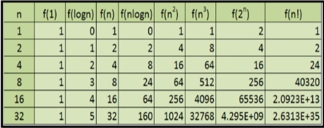

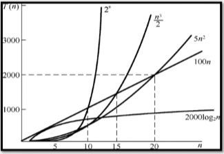


### 1.2.4 空间复杂度
  
- 空间复杂度：算法所需要的存储空间的度量，记作：S(n) = O(f(n))
- 算法所要占据的空间：
  - 算法本身要占据的空间，输入/输出，指令，常数，变量等。
  - 算法要使用的辅助空间。

**举例：**
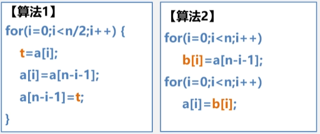

- 算法1：
   - 让第一个和最后一个交换，让第二个和导数第二个进行交换，依次类推。
   - 辅助空间 t 只占一个位置。
   - S(n) = O(1)：原地工作。
- 算法2：
   - 将 a 数组中的元素从最后一个开始依次放到 b 数组中，再放回去。
   - 辅助空间 b 占 n 个位置。
   - S(n) = O(n)：a 数组有多大，b 数组就得有多大。