# 二. 线性表 （Linear List） <!-- omit from toc -->

- [1. 线性表的定义特点及案例引入](#1-线性表的定义特点及案例引入)
  - [1.1. 线性表的定义](#11-线性表的定义)
  - [1.2. 顺序存储结构（Sequential List）案例](#12-顺序存储结构sequential-list案例)
    - [1.2.1. 一元多项式的运算](#121-一元多项式的运算)
    - [1.2.2. 稀疏多项式](#122-稀疏多项式)
  - [1.3. 链式存储结构（Linked List）案例](#13-链式存储结构linked-list案例)
- [2. 顺序表示和实现](#2-顺序表示和实现)
  - [2.1. 顺序存储表示](#21-顺序存储表示)
    - [2.1.1. 多项式的顺序存储结构类型定义](#211-多项式的顺序存储结构类型定义)
    - [2.1.2. 图书表的顺序存储结构类型定义](#212-图书表的顺序存储结构类型定义)
  - [2.2. 基本操作的实现](#22-基本操作的实现)
    - [2.2.1. 顺序表的查找](#221-顺序表的查找)
    - [2.2.2. 顺序表的插入](#222-顺序表的插入)
    - [2.2.3. 顺序表的删除](#223-顺序表的删除)
  - [2.3. 顺序表小结](#23-顺序表小结)
- [3. 链式表示和实现](#3-链式表示和实现)
- [4. 顺序表和链表的比较](#4-顺序表和链表的比较)
- [5. 线性表的应用](#5-线性表的应用)
- [6. 线性表的案例分析与实现](#6-线性表的案例分析与实现)


# 1. 线性表的定义特点及案例引入

## 1.1. 线性表的定义

- 由 n(n >= 0) 个数据元素（结点）a1,a2,…an组成的有限序列。
- 分为：
  - 顺序表（Sequential List）
  - 链式表（Linked List）

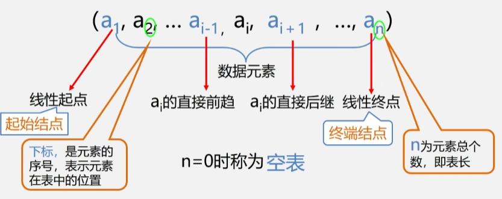

**举例：**


- 在这张表中，要处理的一个数据元素，就是一个同学对应的所有信息。
- 所以线性表中每一个元素不一定是一个值，也可以是自己定义的一个数据类型，比如集合了学号、姓名、性别的数据类型。

**总结：**

- 同一线性表中的元素必定具有相同特性，（字母表中就都是字母，学生表中就都是学生信息）
- 数据元素之间的关系是线性关系。


## 1.2. 顺序存储结构（Sequential List）案例

### 1.2.1. 一元多项式的运算

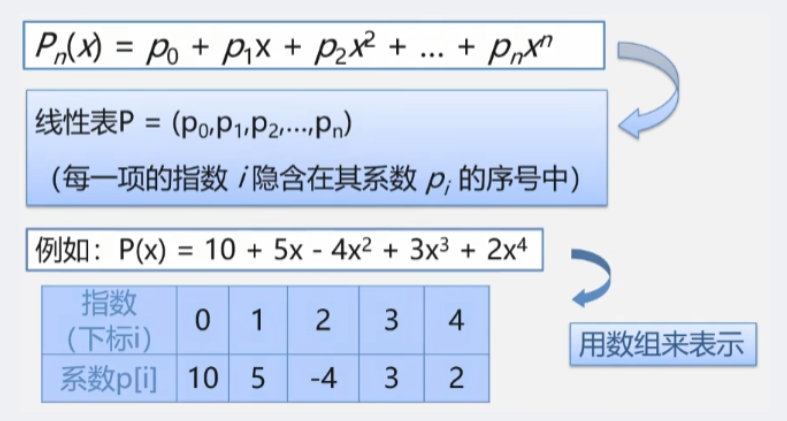

- 线性表 P = (P0, P1, P2… pn)，系数就可以用数组来存储了。

### 1.2.2. 稀疏多项式


- 如果用上面的方法，会有很多0，下标一直到20000.
- 所以只需要记录下每一项的系数是对应多少指数的就可以了，只需要记录系数不为0的项：

1|2|3
:---:|:---:|:---:
0|10000|20000
1|3|2

**稀疏多项式的计算**

求和：

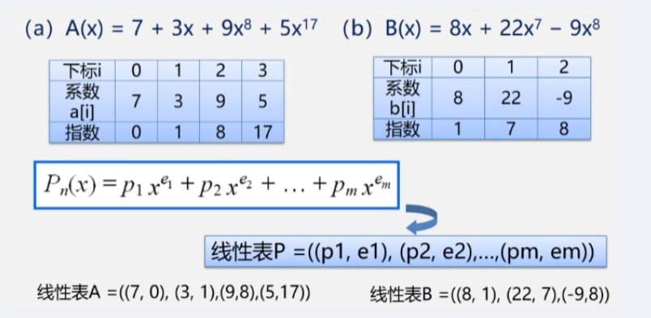
  
- 创建一个新数组C；
- 分别从头遍历比较 A 和 B 的每一项。
   - 若指数相同，则对应系数相加，若其和不为0，则在 c 中增加一个新项。
   - 若指数不相同，则将指数较小的项复制到 C 中。

步骤：

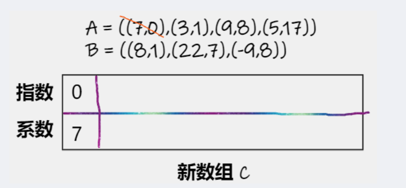

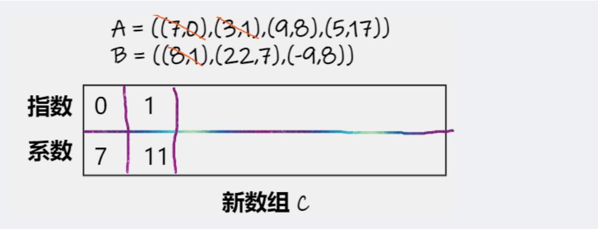

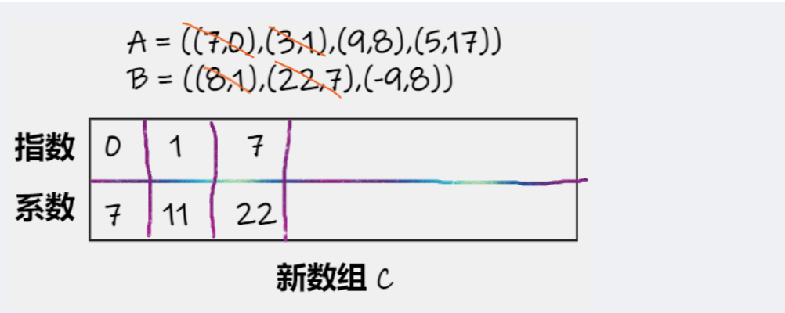

- 但难以定义数组有多大，最多有4+3=7项。但如果有系数互为相反数，和为0，就少于7项。
- 所以：
  - 存储空间分配不灵活
  - 运算的空间复杂度高

## 1.3. 链式存储结构（Linked List）案例

**求多项式和**


- 不用数组来存储 A 和 B 的数据元素，不占用一块连续的空间；
- 用链表的方式来存储，运算的时候需要多少就用多少空间。

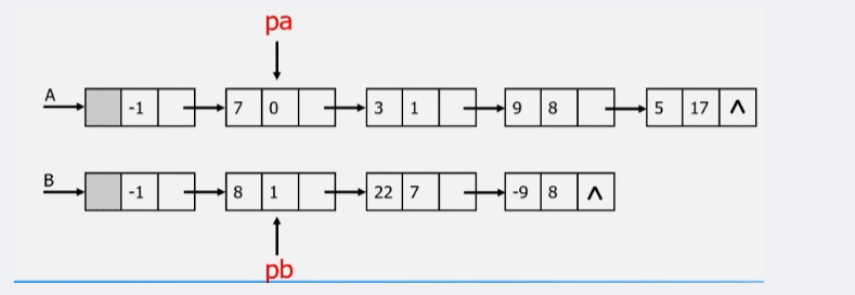
- 同样的方法，比较 A 和 B 两个线性表中每一项的指数；
- 将指数小的保留起来，指数相同则系数相加再保留起来。
- 存起来的元素不再参与计算，将指针后移。

最终：

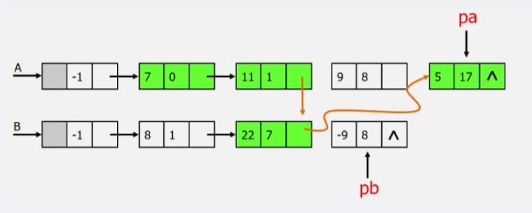


# 2. 顺序表示和实现


## 2.1. 顺序存储表示

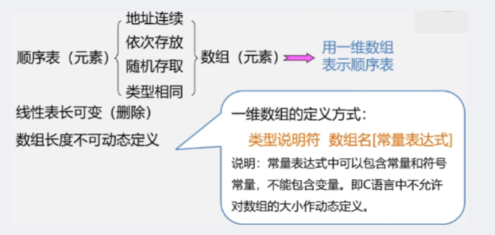

### 2.1.1. 多项式的顺序存储结构类型定义

``` C
#define MAXSIZE 100  //多项式可能达到的最大长度

typedef struct  //多项式非0项的定义
{
        float p;  // 存储非0项的系数
        int   e;  // 存储非0项的指数
}polynomial;

typedef struct
{
        Polynomial* elem;  // 存储空间的首元素地址
        int length;  // 个数

}SqList;  //多项式的顺序存储结构类型为SqList
```

- \* 代表指针，存储地址。
- typedef用于定义数据结构，先定义数据元素的数据类型为 polynomial，再用它定义顺序表叫叫SqList。

### 2.1.2. 图书表的顺序存储结构类型定义

``` C
#define MAXSIZE 100 //图书表可能达到的最大长度

typedef struct //图书信息定义
{
        char  no[20]  ;//图书ISBN
        char  name[50];//图书名
        float price   ;//图书价格
}BOOK;

typedef struct
{
        BOOK* elem ;//存储空间的首元素地址
        int length;//图书表中当前图书的个数

}SqList;//图书表的顺序存储结构类型为SqList

```

## 2.2. 基本操作的实现

**Codes** are avaiable [here](code/).

> 补充：操作算法中用到的预定义常量和类型

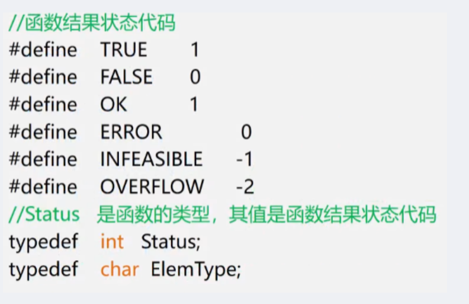

**线性表初始化**


**销毁线性表**


**清空线性表**


**求线性表的长度**


**判断线性表是否为空**


**顺序表的取值**

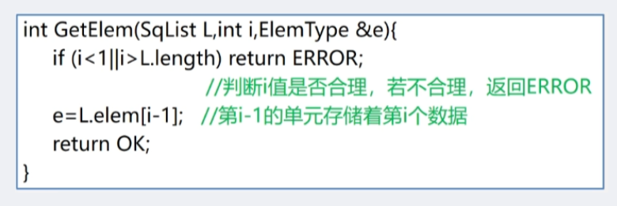

### 2.2.1. 顺序表的查找

- 在线性表 L 中查找与给定值 e 相等的元素，若成功，则返回该元素在表中的序号，反之返回 0。

**for 循环实现顺序查找：**


**while 循环实现顺序查找：**


**算法分析：**

- 平均查找长度 ASL（Average Search Length）
- 需要与给定值进行比较的关键字的个数的期望值叫做平均查找长度。


- $ASL = \frac{n+1}{2}$

### 2.2.2. 顺序表的插入

- 在线性表 L 中第 i 个位置插入新元素 e。

**算法思想：**

1. 判断插入位置 i 是否合法（1<= i <= n+1）。
2. 判断顺序表的存储及空间是否已满。
3. 将第 n 个至第 i 个位置的元素依次向后移动一个位置，空出第 i 个位置（i = n+1时无需移动）。
4. 将要插入的新元素 e 放入第 i 个位置。
5. 表长加1，插入成功返回 OK。


**算法分析：**


### 2.2.3. 顺序表的删除

- 删除线性表 L 中第 i 个位置元素，用 e 返回。

**算法思想：**

1. 判断删除位置 i 是否合法（1 <= i <= n）。
2. 将第 i + 1 个至第 n 个的元素依次往前移动一个位置（i 是最后一个元素时无需移动）。
3. 表长减1，删除成功则返回OK。

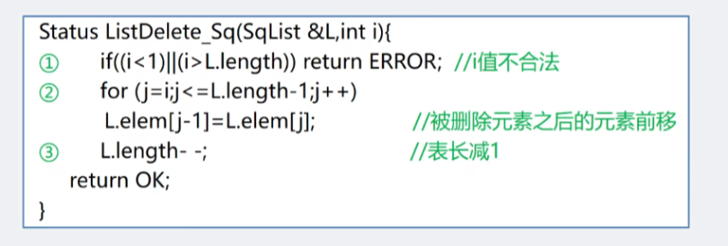

**算法分析：**


## 2.3. 顺序表小结

**顺序表特点**

- 利用数据元素的存储位置表示线性表中相邻的数据元素之间的前后关系，即线性表的逻辑结构与存储结构一致。
- 访问时，可以快速的计算出任何一个数据元素的存储地址。因此可以粗略的认为，访问每个元素所花时间相等。
- 这种存取元素的方法被称为随机存取法。

**顺序表的算法分析**

- 时间复杂度
   - *查找、插入、删除* 的平均时间复杂度为 O(n)。
- 空间复杂度
  - 空间复杂度 S(n) = O(1)（没有占用辅助空间）。

**顺序表优缺点**

- 优点
   - 存储密度大（结点本身所占存储量 / 结点结构所占存储量）。
   - 可以随机存取表中任一元素。
- 缺点：为了克服缺点 —> 链表
   - 在插入、删除某一元素时，需要移动大量元素。
   - 浪费存储空间。
   - 属于静态存储形式，数据元素的个数不能自由扩充。

# 3. 链式表示和实现
# 4. 顺序表和链表的比较
# 5. 线性表的应用
# 6. 线性表的案例分析与实现